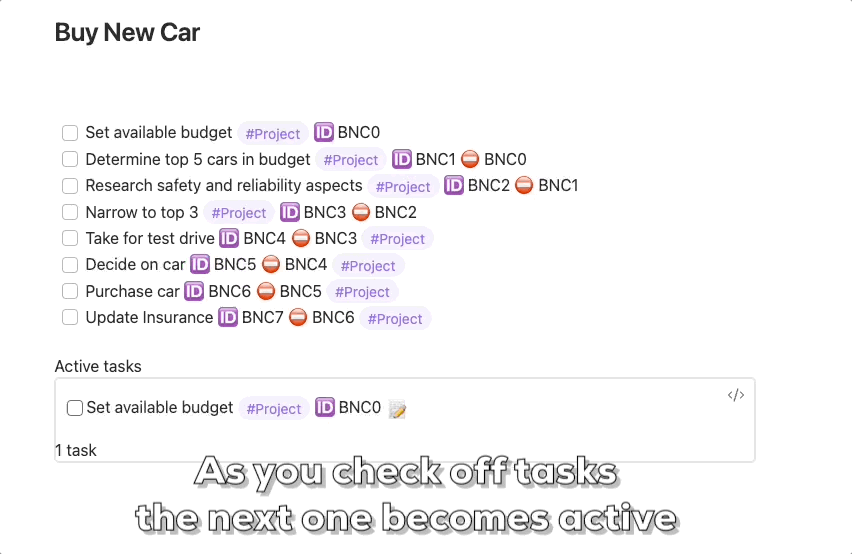

# Obsidian Project Tasks Plugin

Allows you to easily create linked tasks for projects by managing the task ID's and dependencies.

## What is it

This Obsidian plugin allows you to easily manage tasks that are part of an overall project. 

The excellent [Tasks](https://github.com/obsidian-tasks-group/obsidian-tasks) plugin allows you to specify task dependencies but this can be a bit fiddly to manage. This plugin makes it easy to create a sequence of tasks with dependencies. You can create from an existing set of tasks or build the tasks from scratch.

## Dependencies

This plugin requires the [Tasks](https://github.com/obsidian-tasks-group/obsidian-tasks) plugin. 

 Project specific views also requires the [Dataviews](https://github.com/blacksmithgu/obsidian-dataview) plugin but this is optional. 

## Key Highlights

- Automatically create and manage Task ID's 
- Create and manage Task dependencies
- Associate project specific tags
- All existing task functionality like due dates, recurrence
- Tasks continue to work on vaults that do not have the plugin installed
- Use dataviews to show project tasks that are due now
- (Future) Supports parallel task execution
- (Future) Supports optional and conditional tasks

## How to set up

The easiest way is to install the plugin via the Obsidian community plugins screen. 

Additionally, you can clone this repository into your Vault/.obsidian/plugins directory and then enable it in the same way you would normally.

```> git clone https://github.com/paulpaterson/obsidian-project-tasks```

## Usage instructions

The plugin comprises a number of Obsidian commands which can be executed from the Command Palette or bound to hotkeys.

The actions relate to task ID's and dependencies:


- The word after the 🆔 identifies the task ID
- The word after the ⛔ identifies the dependency

For a general description of how dependencies work, see the [Tasks documentation](https://publish.obsidian.md/tasks/Getting+Started/Task+Dependencies). This plugin just automates a common use case to make it easier to use.

There are two core commands and a number of variants that adjust the scope of the "project".

### Add Task ID's

Adds task ID's and dependencies (before and after links) to a series of tasks. This makes the tasks behave as a sequential list. Each task is blocked until the task before it is completed.

```Command: set-ids```


The tasks are now linked as a sequential set. All tasks except the first will be blocked until the first one is completed. When the first task is completed it then unblocks the other tasks.

The format of the project ID's can be controlled using the [Options](#options)

### Project Views

By adding tags to the tasks you can also use the Project View, which is useful to show the currently active tasks. Only tasks that are active, due and not blocked by other tasks will be shown.

You can configure the tag to be added to the tasks in the [Options](#options).

Tasks with tags look like this.


You can then create a view to see only the active tasks.


As you complete tasks in the project the next task up becomes available and you can see this in the view you just created.



You can have the view in any file, it doesn't have to be in the one where the tasks are.

You can customize your own views just using the following block.

```
'''tasks
tags includes #INSERT_TAG_NAME
not done
hide backlink
is not blocked
'''
```

### Nested Tags

TODO: Explain nested tags

### Clear Task ID's

Removes all task ID's and dependencies from all tasks. You can use this if you want to revert back to using disconnected tasks. It removes all ID's and dependencies, even ones which you may have created manually.

```Command: clear-ids```


### Scopes

There are three different scopes which affect which tasks are converted to project tasks (or cleared).

1. Current Selection - impacts only tasks which are currently selected
2. Current Block - impacts tasks in the block or section where the cursor is currently. Blocks begin and end with a Markdown Header. The beginning or end of the file act as block boundaries.
3. Current File - impacts all tasks in the current file

The different commands for creating project ids are:

```
- Command: set-ids
- Command: set-ids-block
- Command: set-ids-file
```

The corresponding commands for clearing project ids are:

```
- Command: clear-ids
- Command: clear-ids-block
- Command: clear-ids-file
```


## Options

### Controlling the form of the Project ID

The ID added to the task by the ```set-ids``` commands can be adjusted to match your own preference using the ```Project ID method``` option. All ID's are of the form of a prefix followed by a number.


In this example the prefix is **BNC** and the number is **1**.

Long ID's tend to look a bit cumbersome in Obsidian and so these options are intended to help you create ID's which are short, unique but still understandable. These options are purely cosmetic, they don't impact how the tasks work. However, it is possible to create some non-unique ID's and currently the plugin doesn't check for that!

There are three main ways to determine the ID.

1. Using a prefix - a standard prefix is used. This is set in the ```Project ID prefix``` option. The number will set to a random number to ensure ID's are unique across the entire vault. You can control the number of digits in the number using the ```Length of random ID number``` option.
2. Using the section name - the header of the section is used for the prefix. If there is no section then the file name is used. The number is sequential in increasing order.
3. Using the file name - the name of the file is used. The number is sequential in increasing order.

When using the section or file name option for the prefix then some other options allow further customization of the ID. These are intended to create shorter ID's which still are recognizable.

1. Remove vowels - lower case vowels are removed from the prefix
2. First letters of words - the prefix is split into words and the first letters are used. The letters are capitalized

### Adding a project tag

You can use the project tag option to automatically add a tag to all tasks in the project. This allows you to use [Project Views](#project-views).

The tag will be added to all tags and will be cleared if you use the ```clear-ids``` command.


